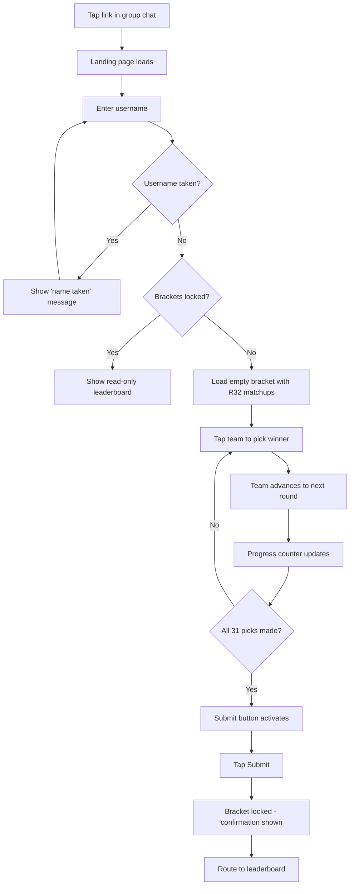
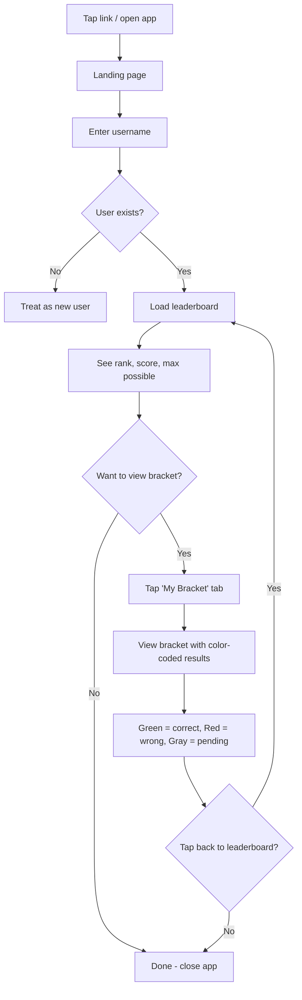
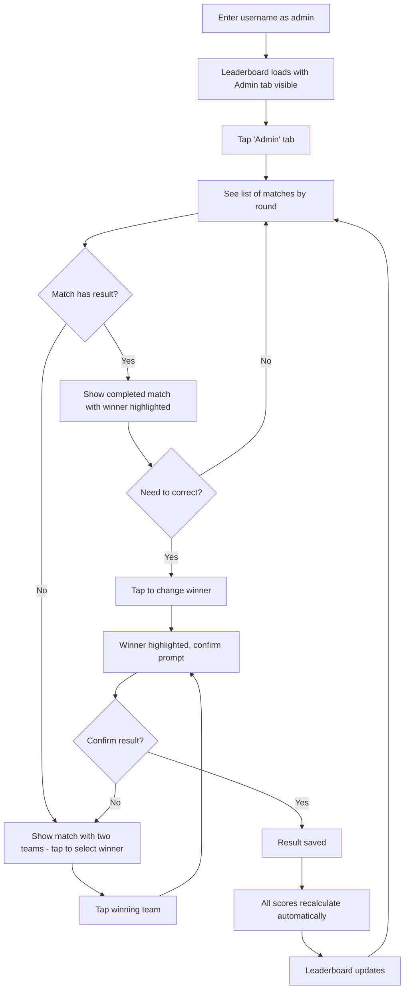
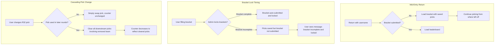

# UX Design Specification worldCup

**Author:** Chris
**Date:** 2026-02-16

---

<!-- UX design content will be appended sequentially through collaborative workflow steps -->

## Executive Summary

### Project Vision

worldCup is a personal, purpose-built web application for a group of 12 friends to participate in a World Cup knockout-stage bracket pool. Participants predict match winners from the Round of 32 through the Final (31 total picks), then track results on a live leaderboard as the tournament unfolds. The app is a passion project — the act of building it is part of the experience. The design philosophy centers on purposeful simplicity: brackets, results, leaderboard. Nothing else.

### Target Users

**Participants (12 friends):** Tech-comfortable sports fans who follow the World Cup. A mix of desktop and mobile users who communicate via group chat. They want quick, frictionless engagement — fill out a bracket, check the leaderboard, talk trash. Not power users seeking deep analytics. Usage is mobile-heavy with quick check-ins during and after matches throughout the ~3 week knockout stage.

**Admin (Chris):** One of the 12 participants who also builds, deploys, and manages the app. Responsible for tournament setup, result entry, and bracket lock control. Plays both competitor and commissioner roles. Admin tools must be accessible without cluttering the participant experience.

### Key Design Challenges

1. **Bracket interaction on mobile** — A 32-team knockout bracket is inherently wide and complex. The UX must make it intuitive and tappable on small screens (round-by-round view) without sacrificing the visual satisfaction of the full bracket tree on desktop.
2. **Zero-friction onboarding in a compressed window** — Users have approximately 24 hours between group stage completion and knockout round start to complete all 31 picks. Any confusion or friction during onboarding directly threatens the core success metric of 12/12 bracket completion.
3. **Dual-role admin experience** — Admin tools (result entry, bracket lock, tournament setup) must be cleanly separated from the participant experience so they don't create clutter or confusion for non-admin users.

### Design Opportunities

1. **"Max possible points remaining" as competitive hook** — This killer differentiator creates ongoing drama and engagement throughout the tournament. Surfacing it prominently on the leaderboard keeps the competition alive even for users trailing on points.
2. **Color-coded bracket storytelling** — Green (correct), red (wrong), and neutral (unplayed) pick indicators turn a static bracket into a visual narrative of each participant's tournament journey. Low effort, high delight.
3. **Elimination drama** — "Eliminated" flags and "busted bracket" indicators add emotional stakes that keep even mathematically eliminated users engaged and entertained in the group experience.

## Core User Experience

### Defining Experience

The core experience of worldCup splits into two distinct phases with different interaction patterns:

**Phase 1 — Bracket Entry (~24 hours):** A focused, one-time session where participants make 31 predictions via tap-to-pick interaction. This is the creative moment — users are crafting their version of the tournament. The bracket must fill in satisfyingly, cascade picks logically, and build momentum toward submission.

**Phase 2 — Tournament Tracking (~3 weeks):** Repeated short visits to check standings after matches are played. Users check the leaderboard, scan their bracket for correct/incorrect picks, and see how their max possible points have shifted. This is the competitive engagement loop.

The critical-to-nail interaction is bracket entry — it happens first, it's the most complex, and if it fails, there's no pool. But the lasting experience lives in leaderboard tracking, which drives repeat engagement throughout the knockout stage.

### Platform Strategy

- **Platform:** Responsive web application, no native app
- **Primary input:** Touch on mobile, mouse/keyboard on desktop
- **Distribution:** Direct link shared in group chat — no app store, no discovery
- **Mobile approach:** Mobile-first design, desktop-enhanced. Round-by-round bracket view on mobile, full bracket tree on desktop
- **Offline:** Not required — always-connected use case with short session durations
- **PWA:** Optional add-to-home-screen for convenience, not a requirement

### Effortless Interactions

- **Link to first pick:** The entire path from tapping a group chat link to making the first bracket pick should require exactly one intermediary step (entering a username). No sign-up, no verification, no tutorial.
- **Checking standings:** Opening the app as a returning user should land on the leaderboard immediately — current rank, score, max possible, and champion pick status visible without scrolling.
- **Result awareness:** After a match is played and results are entered, the impact on scores and standings should be immediately obvious — no hunting or calculating needed.
- **Return access:** Re-entering a username gets you back to your bracket and the leaderboard. No password recovery, no email verification.

### Critical Success Moments

1. **First pick made** — The moment a user taps a team and sees it cascade into the next round. This confirms "I know how this works" and builds confidence to complete all 31 picks.
2. **Bracket submitted** — The completion moment when all 31 picks are locked in. Should feel like a satisfying commitment, not an anxious "did it work?"
3. **First result lands** — The first time a user checks back and sees green/red picks on their bracket and movement on the leaderboard. This is the "this is better than ESPN" moment.
4. **Max possible points shift** — The moment a user realizes their ceiling has changed (or someone else's has collapsed). This is the killer feature — it creates stories and drama that fuel group chat conversation.

### Experience Principles

1. **One-tap clarity** — Every interaction resolves in a single tap with immediate visual feedback. Pick a winner, check a score, see where you stand — one action, instant response.
2. **Zero-instruction onboarding** — A user landing from a group chat link understands exactly what to do without any tutorial, tooltip, or explanation. The UI teaches itself.
3. **Leaderboard as the heartbeat** — The leaderboard is where competitive energy lives. It loads fast, tells the full story at a glance, and pulls users back after every round of matches.
4. **Bracket as canvas, not form** — Filling out 31 picks feels like crafting a tournament story, not filling out a form. Visual momentum through progress counting, cascading picks, and the bracket filling in makes it satisfying.

## Desired Emotional Response

### Primary Emotional Goals

1. **Competitive excitement** — The app should amplify the thrill of competition within a trusted friend group. Every leaderboard check, every result update should fuel the competitive fire that drives group chat trash talk.
2. **Group belonging** — This isn't a platform — it's "our thing." The intimacy of a purpose-built app for 12 specific people should come through in every interaction. The app is an extension of the friend group, not a separate destination.
3. **Builder's craft appreciation** — Users should feel impressed that a friend built this. Clean, polished, and thoughtful — not over-engineered, but clearly made with care.

### Emotional Journey Mapping

| Stage | Desired Emotion | Design Implication |
|-------|----------------|-------------------|
| First landing | "Oh nice, this is clean" — impressed simplicity | Minimal UI, no clutter, immediate clarity of purpose |
| Bracket entry | Momentum and fun — "I'm building my tournament" | Progress counter, cascading picks, satisfying visual feedback |
| After submission | Committed confidence — "My picks are locked, bring it on" | Clear confirmation, bracket displayed as a finished artifact |
| Checking results | Competitive tension — "Where do I stand?" | Fast-loading leaderboard, immediate color-coded bracket updates |
| Bad pick revealed | Playful loss — "oof" not "error" | Red indicator feels like sports disappointment, not system failure |
| Returning visits | Anticipation — "What happened while I was away?" | Leaderboard-first return experience, visible changes since last visit |

### Micro-Emotions

- **Confidence over confusion** — Critical during bracket entry. Every interaction must reinforce "I know exactly what to do." No ambiguous buttons, no unclear states.
- **Excitement over anxiety** — Checking results should feel like watching highlights, not opening a grade report. The competitive element is fun tension, not stress.
- **Belonging over isolation** — The leaderboard connects all 12 participants in a shared narrative. Seeing everyone's champion picks, scores, and elimination status reinforces "we're all in this together."
- **Delight over mere satisfaction** — Small touches elevate the experience from functional to memorable. Country flags, color-coded picks, crown icons, and progress indicators transform utility into craft.

### Design Implications

- **Competitive excitement** → Bold leaderboard typography, prominent rank numbers, visible max possible points creating "what if" scenarios
- **Group belonging** → All 12 users visible on one leaderboard screen, champion picks displayed as personal identity, shared experience over individual isolation
- **Builder's craft** → Polished micro-interactions, consistent visual language, attention to detail in spacing/alignment/color that signals "someone cared about this"
- **Playful loss** → Red pick indicators styled as sports outcomes (strikethrough, fade) rather than error states (red alerts, warning icons)
- **Momentum during entry** → Progressive bracket completion with visual feedback, "17 of 31" counter that builds anticipation toward submission

### Emotional Design Principles

1. **Sports emotions, not software emotions** — Every feedback state should feel like a sports moment. A wrong pick is a loss, not an error. A correct pick is a win, not a success message. The app lives in the world of competition, not computation.
2. **Intimacy through scale** — Design for exactly 12 users. No pagination, no "load more," no generic user avatars. The leaderboard fits on one screen because it's meant to.
3. **Craft signals care** — Small details (flag icons, color transitions, consistent spacing) communicate that this was built with intention. Users should notice the quality without being able to articulate why it feels good.
4. **Tension is the feature** — The emotional arc of the bracket pool is uncertainty. Design choices should preserve and amplify tension (max possible points, elimination flags) rather than resolve it prematurely.

## UX Pattern Analysis & Inspiration

### Inspiring Products Analysis

**ESPN Tournament Challenge**
- Iconic bracket tree visualization with converging layout is immediately recognizable to sports fans
- Color-coded picks (green correct, red wrong) provide instant feedback after results land
- Group leaderboard filtering enables competition within a circle of friends
- Weakness: Login friction, ads, feature bloat — designed for millions, not for 12

**NCAA March Madness Bracket Apps**
- Tap-to-pick bracket interaction is the established standard — users already know this pattern
- Progress tracking ("X of 63 picks made") builds completion momentum
- Brackets become shareable artifacts people screenshot and discuss
- Weakness: Mobile bracket interaction often relies on pinch-zoom, which feels clunky and unnatural

**Yahoo Fantasy**
- Clean leaderboard with at-a-glance standings and fast mobile loading
- Weekly competitive loop (check scores, see rankings shift) maps to knockout-round rhythm
- Thumb-friendly mobile experience with simple navigation
- Weakness: Information density and feature complexity far beyond what a 12-person pool needs

### Transferable UX Patterns

- **Tap-to-pick bracket entry** (March Madness) — The established interaction pattern for tournament predictions. Users already understand it. No need to innovate here — just execute it cleanly.
- **Green/red color-coding** (ESPN) — Universally understood by sports fans for correct/incorrect picks. Zero learning curve.
- **At-a-glance leaderboard** (Yahoo Fantasy) — Rank, score, and key stats visible without interaction. Fast-loading, mobile-optimized.
- **Progress counter** (March Madness) — "17 of 31 picks made" builds momentum and signals completion state during bracket entry.

### Anti-Patterns to Avoid

- **Login walls** (ESPN) — Any authentication beyond username entry kills the group-chat-to-first-pick flow
- **Full bracket on mobile** (March Madness) — Pinch-zoom on a tournament tree is universally frustrating. Round-by-round mobile view eliminates this entirely.
- **Feature density** (Yahoo Fantasy) — Settings, notifications, news feeds, and navigation depth have no place in a 12-person bracket pool
- **Generic group experience** (ESPN) — Group leaderboards that feel like filtered global rankings. This leaderboard IS the whole world — 12 people, one screen, no filtering.

### Design Inspiration Strategy

**Adopt directly:**
- Tap-to-pick bracket interaction — proven, familiar, no reinvention needed
- Green/red color-coding for pick results — instant comprehension
- Progress counter during bracket entry — completion momentum

**Adapt and simplify:**
- Yahoo's leaderboard clarity — strip to rank, score, max possible, champion pick. Nothing else.
- March Madness bracket layout — full tree on desktop, round-by-round on mobile. Two modes, clean separation.

**Reject entirely:**
- Any login or account creation flow beyond username entry
- Navigation depth beyond a single level (bracket view, leaderboard view, admin view)
- Feature additions that don't serve brackets, results, or leaderboard
- Information density designed for power users or mass audiences

## Design System Foundation

### Design System Choice

**Tailwind CSS + shadcn/ui** — A utility-first CSS framework paired with a copy-paste component library that provides owned, customizable components with no dependency lock-in.

### Rationale for Selection

- **Simplicity-first alignment** — Tailwind's utility classes keep styling close to the markup with zero abstraction overhead. No fighting against opinionated component library defaults.
- **Custom bracket flexibility** — The bracket visualization is the most complex UI element and is inherently custom. Tailwind provides full control without a component library getting in the way.
- **Clean defaults for simple parts** — shadcn/ui provides accessible, well-designed components for the straightforward elements: username input, buttons, leaderboard table rows, admin controls. No need to design these from scratch.
- **No dependency lock-in** — shadcn/ui components are copied into the project as source code. Full ownership, no version upgrade surprises, no unused component bloat.
- **Next.js ecosystem fit** — Both Tailwind and shadcn/ui are first-class citizens in the Next.js ecosystem, with strong community support and documentation.
- **Solo developer efficiency** — Minimal learning curve, fast iteration, and the ability to style everything inline without context-switching between files.

### Implementation Approach

- Install Tailwind CSS as part of Next.js project initialization (built-in support)
- Initialize shadcn/ui and selectively add only the components needed: Button, Input, Table, Card, Badge
- Define a minimal theme configuration in `tailwind.config` for consistent colors, spacing, and typography
- Build the bracket visualization as a fully custom component using Tailwind utilities directly
- Use shadcn/ui components for landing page, leaderboard, and admin interfaces

### Customization Strategy

- **Color palette:** Define tournament-specific colors (team colors, correct/incorrect pick indicators, elimination states) as Tailwind theme extensions
- **Typography:** Single font stack, two weights maximum — keep it clean and fast-loading
- **Spacing:** Consistent spacing scale from Tailwind defaults — no custom spacing tokens needed
- **Components:** Only add shadcn/ui components as needed. If a component isn't used, it doesn't exist in the project.
- **Bracket-specific styles:** Custom Tailwind utilities or component classes for bracket lines, match cards, and round layouts — these have no pre-built equivalent and shouldn't pretend to.

## Defining Experience

### Core Interaction

**"Tap a team, watch your bracket build."**

The defining experience of worldCup is the bracket picking interaction — tap a team name, watch it advance to the next round, see the bracket fill in toward a champion. This single interaction, executed cleanly, is what makes the product work. Everything else (leaderboard, results, admin tools) exists to give this interaction context and consequence.

### User Mental Model

Users bring a fully established mental model from March Madness bracket apps and sports fandom. No concept education is needed — they know:

- A bracket is a tournament tree where winners advance
- Tapping a team means "I predict this team wins"
- Picks cascade forward — picking a Round of 32 winner makes that team available in the Round of 16
- Changing an early pick clears dependent downstream picks
- A complete bracket means picking a winner for every matchup through the Final

**Where worldCup differentiates from the mental model:** The bracket interaction itself is proven and familiar. The novel elements surround it — an intimate 12-person leaderboard, max possible points remaining, and elimination flags create competitive context that commercial platforms can't match at this scale.

### Success Criteria

- **"This just works"** — Tap a team, it advances. No delay, no confirmation dialog, no ambiguity about what happened. Immediate visual feedback.
- **Momentum** — The progress counter ("17 of 31 picks made") and the bracket visually filling in create a sense of building toward completion. Users should feel pulled toward finishing.
- **Confidence** — At no point should a user wonder "did that work?" or "what do I do next?" The next unpicked matchup should be visually obvious.
- **Speed** — The full 31-pick bracket should be completable in under 3 minutes for a decisive user. No friction between picks.
- **Automatic cascading** — Changing a Round of 32 pick automatically clears that team from all future rounds if it was picked further. No manual cleanup. The system handles it.

### Novel UX Patterns

**Established patterns (adopt directly):**
- Tap-to-pick bracket entry — proven interaction, zero learning curve
- Tournament tree visualization — universally understood bracket layout
- Cascading pick logic — expected behavior when changing earlier picks
- Progress counter — familiar completion indicator

**Novel elements (worldCup differentiators):**
- **Max possible points remaining** — No mainstream bracket app surfaces this prominently. It creates ongoing competitive drama throughout the tournament.
- **Elimination flags** — Mathematical elimination tracking turns the leaderboard into a living narrative. Users who can't win are still part of the story.
- **Intimate scale design** — Designing for exactly 12 users (no pagination, no filtering, one-screen leaderboard) is the opposite of how bracket platforms are built. This intimacy is a feature.

### Experience Mechanics

**1. Initiation:**
- User taps group chat link, enters username, lands on an empty bracket with all R32 matchups populated
- The first matchup is visually prominent — two team names with flags, ready to be tapped
- No instructions needed — the bracket layout and tappable teams communicate the interaction

**2. Interaction:**
- Tap a team name → team advances to the next round slot with immediate visual feedback
- The advanced team appears in the next round's matchup, ready to be picked again if the opponent slot is also filled
- Progress counter updates: "1 of 31 picks made"
- Changing a pick: tap the other team in the same matchup → previous pick is replaced, downstream picks involving the removed team are cleared automatically

**3. Feedback:**
- Immediate: Selected team visually moves to the next round position
- Progressive: Counter increments, bracket visually fills in, champion slot approaches
- Error prevention: Submit button disabled until all 31 picks are complete — no partial submissions possible
- Post-tournament: Picks color-code as results come in — green (correct), red (wrong), neutral (unplayed)

**4. Completion:**
- All 31 picks made → progress counter shows "31 of 31" → Submit button activates
- User taps Submit → confirmation moment → bracket is locked
- User is routed to the leaderboard to see their position among the 12 participants
- From this point forward, the bracket becomes a read-only artifact that updates with color-coded results

## Visual Design Foundation

### Color System

**Philosophy:** Neutral, cool-toned palette that stays out of the way and lets country flags provide the color personality. The UI is the stage, not the star.

**Base Palette:**
- **Background:** White (`#FFFFFF`) for primary surfaces, Slate 50 (`#F8FAFC`) for secondary/alternating surfaces
- **Text:** Slate 900 (`#0F172A`) for primary text, Slate 500 (`#64748B`) for secondary/muted text
- **Borders:** Slate 200 (`#E2E8F0`) for dividers and card borders
- **Interactive:** Slate 700 (`#334155`) for buttons and actionable elements

**Semantic Colors (functional only):**
- **Correct pick:** Emerald 500 (`#10B981`) — green signals "win" universally in sports
- **Wrong pick:** Red 500 (`#EF4444`) — red signals "loss" without feeling like a software error
- **Unplayed/Pending:** Slate 300 (`#CBD5E1`) — neutral, clearly distinct from correct/wrong
- **Eliminated:** Slate 400 (`#94A3B8`) with reduced opacity — faded out, not highlighted
- **Champion pick alive:** Emerald 100 (`#D1FAE5`) background accent on leaderboard
- **Champion pick eliminated:** Red 100 (`#FEE2E2`) background accent on leaderboard

**What carries color:** Country flags, pick result indicators (green/red), and leaderboard status badges. Everything else is neutral grayscale. The flags do the visual heavy lifting.

### Typography System

**Font Stack:** System font stack — no custom fonts to load.
```css
font-family: -apple-system, BlinkMacSystemFont, 'Segoe UI', Roboto, sans-serif;
```

**Type Scale (minimal):**
- **Page title:** 24px / bold — used once per view (e.g., "Leaderboard", "Your Bracket")
- **Section header:** 18px / semibold — round labels ("Round of 32", "Quarterfinals")
- **Body/Team names:** 16px / regular — primary readable size for team names, usernames, scores
- **Supporting text:** 14px / regular — secondary info like "17 of 31 picks made", timestamps
- **Badge/label:** 12px / semibold — small labels like "ELIMINATED", rank numbers

**Two weights only:** Regular (400) and Semibold (600). Bold reserved for page titles only.

**Line height:** 1.5 for body text, 1.2 for headings. Generous leading for readability.

### Spacing & Layout Foundation

**Spacing Unit:** 4px base, with a practical scale of 4, 8, 12, 16, 24, 32, 48, 64.

**Layout Philosophy:** Spacious and breathable. White space is a feature, not wasted space. Every element should have room to be clearly distinct from its neighbors.

**Layout Principles:**
- **Single-column on mobile** — no side-by-side layouts that compete for attention on small screens
- **Centered content on desktop** — max-width container (960px) centered on screen, preventing ultra-wide line lengths
- **Generous padding** — 16px minimum padding on interactive elements (match cards, leaderboard rows) for comfortable tap targets
- **Clear separation** — 24px minimum between distinct content groups (between matches, between leaderboard sections)

**Grid:**
- No formal grid system needed — the app has three simple views, not a complex dashboard
- Bracket layout uses a custom structure (rounds as columns on desktop, stacked on mobile)
- Leaderboard is a single-column list
- Landing page is a centered single input

**Responsive Breakpoints:**
- **Mobile:** < 768px — round-by-round bracket view, stacked layout
- **Desktop:** >= 768px — full bracket tree, spacious horizontal layout

### Accessibility Considerations

- **Contrast ratios:** All text meets WCAG AA minimum (4.5:1 for body text, 3:1 for large text). Slate 900 on White = 15.4:1. Slate 500 on White = 4.6:1.
- **Color is not the only indicator:** Correct/wrong picks use green/red AND a secondary indicator (checkmark/X or strikethrough) so color-blind users can distinguish states
- **Tap targets:** Minimum 44x44px for all interactive elements (team names in bracket, leaderboard rows)
- **Font sizing:** Base 16px ensures readability without zooming on mobile. No text smaller than 12px.
- **Focus states:** Visible focus rings on all interactive elements for keyboard navigation on desktop

## Design Direction

### Directions Explored

Design direction mockups were generated as an interactive HTML showcase (`planning-artifacts/ux-design-directions.html`) exploring variations across four dimensions:

- **Landing Page:** Pure minimal (A) vs. card with context status (B)
- **Leaderboard:** Clean table (A) vs. card list (B)
- **Navigation:** Top tabs (A) vs. bottom tab bar with icons (B)
- **Bracket:** Desktop full tree + mobile round-by-round (unified approach, no alternatives needed)

### Chosen Direction

**Landing Page — Pure Minimal (A):** Logo, subtitle, username input, enter button. Nothing else. Zero distraction, instant comprehension. The user's eye goes directly to the input field.

**Leaderboard — Clean Table (A, simplified):** Traditional table layout with columns: Rank, Name, Score, Max, Champion. No status badge column — elimination state is already communicated through max possible points (a user who can't win has a max lower than the leader's current score) and champion pick strikethrough (eliminated champion is visually struck through). Crown icon on the #1 position. Current user's row highlighted with subtle green background.

**Navigation — Top Tabs (A):** Simple underline tab bar below the app header. Two tabs for participants (Leaderboard, My Bracket). Third tab (Admin) appears only for the admin user. Clean, minimal, same pattern on desktop and mobile.

**Bracket — Dual-mode:** Full bracket tree on desktop (horizontal rounds converging toward champion). Round-by-round view on mobile (one round at a time, left/right navigation between rounds). Progress bar and pick counter during entry. Score and max possible display after results. Green/red color-coding with checkmark/X indicators for correct/wrong picks post-results.

### Design Rationale

- **Simplicity over cleverness** — Every chosen direction is the simpler option. Top tabs over bottom bar. Table over cards. Minimal landing over contextual landing. The app does three things; the design should feel like it does three things.
- **Familiar patterns** — Top tabs, table leaderboards, and bracket trees are patterns every sports fan has seen. No learning curve.
- **Information through reduction** — Removing the status badge column demonstrates the principle: if the data already tells the story (max points, champion strikethrough), don't add a label restating it.
- **Consistent across breakpoints** — Top tabs work identically on desktop and mobile, reducing implementation complexity and user confusion.

### Implementation Approach

- Landing page: Single centered component with conditional status line (can be added in Phase 2 if desired)
- Leaderboard: HTML table with Tailwind styling, highlighted current user row, crown icon on rank 1
- Navigation: Tab component from shadcn/ui, conditionally rendering admin tab based on user role
- Bracket (desktop): Custom CSS grid/flexbox layout with rounds as columns, connector lines between rounds
- Bracket (mobile): Stacked match cards with round navigation buttons, progress bar component
- Results overlay: Conditional styling classes for correct (green), wrong (red), pending (gray) states

## User Journey Flows

### Journey 1: New User → Bracket Submission

The complete first-time experience from group chat link to locked bracket.



**Key interactions:**
- **Entry:** Single username input, no password, no verification
- **Bracket loading:** All R32 matchups pre-populated by admin, user sees full bracket (desktop) or first round (mobile)
- **Picking:** Tap team name → team advances → counter increments. Repeat 31 times.
- **Cascading:** Changing an earlier pick clears dependent downstream picks, counter adjusts
- **Submission gate:** Submit button disabled until 31/31 picks complete. No partial submissions.
- **Post-submit:** Bracket becomes read-only, user lands on leaderboard

**Error prevention:**
- Username collision handled inline with immediate feedback
- No "are you sure?" on individual picks — only the final submit matters
- Progress counter prevents accidental early submission attempts

### Journey 2: Returning User → Leaderboard Check

The repeat engagement loop throughout the knockout stage.



**Key interactions:**
- **Entry:** Same username input as first visit. Returns user directly to leaderboard.
- **Leaderboard first:** Returning users land on standings — the competitive hook that drives return visits
- **Bracket as reference:** "My Bracket" tab shows read-only bracket with color-coded results
- **Session duration:** Typically under 60 seconds — check standings, glance at bracket, done

**Optimization:**
- Leaderboard loads fast — 12 rows, pre-computed scores, no heavy queries
- Current user's row highlighted so they find themselves instantly
- Score and max possible visible without any interaction

### Journey 3: Admin → Result Entry

How Chris enters match results after games are played.



**Key interactions:**
- **Admin tab:** Only visible when logged in as admin. Third tab in navigation, clean separation from participant views.
- **Match list:** Matches grouped by round, displayed as simple two-team cards. Unresolved matches are visually distinct from completed ones.
- **Result entry:** Tap a match → tap the winning team → confirm. Two taps plus confirmation per result.
- **Confirmation:** Single confirm step before saving — prevents accidental result entry. This is the one place where "are you sure?" is appropriate.
- **Correction:** Tap a completed match to change the result. Scores recalculate automatically. No separate "undo" flow — just re-enter the correct winner.
- **Bracket lock:** Toggle switch in admin view to lock/unlock all brackets. Simple on/off.

**Additional admin actions (same view):**
- **Tournament setup:** Input R32 matchups before bracket entry opens (one-time setup)
- **Bracket lock toggle:** Lock brackets when entry window closes

### Journey 4: Edge Cases



**Mid-entry return:** Picks are saved as they're made (not only on submit). A user who closes the app mid-bracket returns to their in-progress bracket with all picks intact.

**Bracket lock while incomplete:** If admin locks brackets before a user finishes, their partial picks are saved but the bracket is not submitted. They cannot win but their incomplete bracket is preserved. This is an acceptable edge case for a 12-person trust-based group.

**Cascading pick changes:** Clearly the most complex interaction. When a user changes a pick in an earlier round, the system must identify all downstream picks that depended on the removed team and clear them. The progress counter decreases accordingly. The user immediately sees which later picks were affected.

### Journey Patterns

**Consistent patterns across all journeys:**

- **Single entry point:** Every journey starts with the same landing page and username input. No deep links, no multiple entry paths.
- **Tab-based navigation:** All post-login navigation happens through the top tab bar. Leaderboard and My Bracket for participants, plus Admin for Chris.
- **Immediate feedback:** Every action (pick, result entry, tab switch) produces instant visual feedback. No loading spinners for local state changes.
- **No dead ends:** Every view has a clear path forward or back. The tab bar is always visible, providing escape routes from any state.

### Flow Optimization Principles

1. **Minimize taps to value** — New user reaches first bracket pick in 2 taps (enter name, tap enter). Returning user sees leaderboard in 2 taps. Admin enters a result in 3 taps (match, winner, confirm).
2. **Save state aggressively** — Bracket picks save as they're made, not on submit. No lost work from app closure, network issues, or accidental navigation.
3. **One confirmation point** — Individual bracket picks require no confirmation (easily reversible). Bracket submission and result entry require confirmation (harder to reverse). Match the confirmation cost to the action weight.
4. **Progressive disclosure** — Show the bracket, not instructions. Show the leaderboard, not a dashboard. The most important content is always the first thing visible.

## Component Strategy

### Design System Components (shadcn/ui)

Components used directly from shadcn/ui with minimal customization:

| Component | Usage | Customization |
|-----------|-------|---------------|
| **Button** | Submit bracket, Enter username, confirm dialogs | Slate 900 primary, ghost variant for secondary actions |
| **Input** | Username entry on landing page | Centered text, 16px font, generous padding |
| **Table** | Leaderboard standings | Custom row highlighting for current user, crown icon in rank column |
| **Tabs** | Top navigation (Leaderboard / My Bracket / Admin) | Underline indicator style, conditional admin tab |
| **Switch** | Bracket lock toggle in admin view | Standard toggle with label |

### Custom Components

#### MatchCard

**Purpose:** Displays a single matchup between two teams. Used in both bracket entry (tap to pick) and admin result entry (tap to set winner).

**Anatomy:**
- Two team rows stacked vertically, each containing: country flag, team name, selection indicator
- Top team has rounded top corners, bottom team has rounded bottom corners
- 1px border between teams, outer border wraps the pair

**States:**
- **Default:** Both teams neutral, ready for selection
- **Selected (entry):** Picked team has green-tinted background and checkmark
- **Correct (results):** Green background, checkmark, team name in dark green
- **Wrong (results):** Red background, X mark, team name struck through
- **Pending (results):** Gray/muted, no indicator
- **Hover:** Subtle background shift on the hovered team row

**Interaction:** Tap/click a team row to select it as the winner. In bracket entry, the selected team cascades to the next round's MatchCard.

**Accessibility:** Each team row is a button with aria-label "[Team name] wins". Selected state announced via aria-pressed.

#### BracketTree (Desktop)

**Purpose:** Full tournament bracket visualization showing all rounds from R32 to Final in a horizontal tree layout.

**Anatomy:**
- Rounds displayed as columns flowing left to right
- Each round contains MatchCards vertically spaced with increasing gaps per round
- Connector lines link winning team slots to the next round's MatchCard
- Round labels above each column ("Round of 32", "Round of 16", "Quarterfinals", "Semifinals", "Final")
- Champion slot at the far right

**States:**
- **Entry mode:** Empty bracket with R32 matchups populated, MatchCards in default/selected states
- **Results mode:** MatchCards show correct/wrong/pending states, connector lines colored to match

**Responsive:** Only rendered at >= 768px. Below that, replaced by RoundView.

#### RoundView (Mobile)

**Purpose:** Single-round bracket view for mobile, showing all matchups in one round with navigation between rounds.

**Anatomy:**
- Round navigation header: left arrow, round name, right arrow
- Vertically stacked MatchCards for all matchups in the current round
- Progress bar at bottom (entry mode) or score summary (results mode)

**States:**
- **Entry mode:** MatchCards tappable, progress bar showing "X of 31 picks made" with fill bar
- **Results mode:** MatchCards show correct/wrong/pending, score summary shows "Score: X pts - Max: Y"

**Interaction:** Left/right buttons (or swipe) navigate between rounds. Only rounds with matchups available are navigable (later rounds unlock as picks cascade forward).

#### ProgressBar

**Purpose:** Shows bracket completion progress during entry.

**Anatomy:**
- Text counter: "17 of 31 picks made"
- Thin horizontal fill bar beneath (Emerald 500 fill on Slate 200 track)

**States:**
- **In progress:** Counter and bar update with each pick/unpick
- **Complete:** "31 of 31 picks made" — bar fully filled, triggers submit button activation

#### AdminMatchCard

**Purpose:** Match card variant for admin result entry. Similar to MatchCard but with confirmation step.

**Anatomy:**
- Same two-team layout as MatchCard
- After tapping a winner: confirm/cancel buttons appear below the card
- Completed matches show the winner highlighted with a "Result saved" indicator

**States:**
- **Unresolved:** Both teams neutral, visually distinct from resolved matches (e.g., slightly more prominent border)
- **Winner selected (pending confirm):** Selected team highlighted, confirm/cancel buttons visible
- **Resolved:** Winner highlighted, subtle "saved" indicator, tappable to correct

**Interaction:** Tap team → confirm button appears → tap confirm to save. Tap a resolved match to re-enter correction flow.

### Component Implementation Strategy

- **Build order follows user journeys:** MatchCard and BracketTree/RoundView first (bracket entry journey), then Table-based leaderboard, then AdminMatchCard
- **Shared MatchCard base:** The bracket MatchCard and AdminMatchCard share the same visual base component with different interaction handlers and the addition of confirm/cancel for admin
- **Tailwind-only styling:** All custom components styled with Tailwind utilities directly — no separate CSS files, no CSS modules
- **State management via props:** Components are stateless/presentational where possible. State lives in the parent page component. MatchCard receives `team1`, `team2`, `selectedTeam`, `result`, and `onSelect` as props.
- **No premature abstraction:** Build MatchCard for the bracket first. Extract shared patterns with AdminMatchCard only after both exist and the overlap is clear.

### Implementation Roadmap

**Phase 1 — Bracket Entry (MVP critical path):**
- MatchCard — the core interaction component
- BracketTree (desktop) — full tree layout with connector lines
- RoundView (mobile) — round-by-round with navigation
- ProgressBar — completion tracking
- Button, Input (shadcn/ui) — landing page and submit

**Phase 2 — Leaderboard & Results:**
- Table (shadcn/ui) — leaderboard with custom row styling
- Tabs (shadcn/ui) — top navigation
- MatchCard results states — correct/wrong/pending styling

**Phase 3 — Admin:**
- AdminMatchCard — result entry with confirmation
- Switch (shadcn/ui) — bracket lock toggle
- Admin match list grouped by round

## UX Consistency Patterns

### Button Hierarchy

**Primary action (one per view):**
- Slate 900 background, white text, 16px semibold, full-width on mobile, auto-width on desktop
- Used for: "Enter" on landing page, "Submit Bracket" on bracket view, "Confirm" on admin result entry
- Rule: Only one primary button visible at a time. If there's one action that matters, it's primary.

**Secondary action:**
- White background, Slate 200 border, Slate 700 text, 14px regular
- Used for: "Cancel" on admin confirm, round navigation arrows on mobile bracket
- Rule: Secondary buttons support the primary action or provide navigation. Never compete visually.

**Disabled state:**
- Slate 100 background, Slate 400 text, no hover effect, cursor not-allowed
- Used for: "Submit Bracket" when picks < 31, navigation arrows when no next/previous round exists
- Rule: Disabled buttons stay visible to communicate "this will be available when..." — never hide them.

**Destructive action:**
- Red 500 text, no background, underline on hover
- Used for: None in MVP. Reserved for future features if needed (e.g., "Reset bracket" in Phase 2).

### Feedback Patterns

**Success feedback:**
- No toast notifications, no banners. Success is communicated through state change in the UI itself.
- Bracket pick: team visually advances to next round + counter increments = success confirmed
- Bracket submission: bracket becomes read-only + route to leaderboard = success confirmed
- Admin result entry: match card updates to show winner + scores recalculate = success confirmed
- Rule: If the UI reflects the change, the user already knows it worked. Don't add a "Success!" message on top of visible confirmation.

**Error feedback:**
- Inline, adjacent to the action that caused it
- Username taken: red text below the input field — "That name is already taken"
- Network error: subtle banner at top of view — "Couldn't save. Check your connection and try again."
- Rule: Errors appear where the user is already looking. No pop-ups, no modals, no redirects.

**State change feedback:**
- Pick made: immediate visual change (green tint + checkmark) — no animation delay
- Pick changed: previous selection clears, new selection appears, downstream picks cleared with counter adjustment
- Result entered: match card transitions from unresolved to resolved state
- Rule: State changes are instant and visual. The UI is the feedback mechanism.

**Empty/zero states:**
- No results yet: leaderboard shows all 12 users with score "0" and max points at maximum — never show "No data" or an empty table
- No picks yet: bracket shows all R32 matchups with no selections — the empty bracket IS the invitation to start picking
- Rule: Empty states should look like the full state minus the user's input. The structure is always visible.

### Loading States

**Initial page load:**
- Server-side render the page structure immediately (Next.js SSR) — no loading spinner for the initial view
- Data that requires fetching (leaderboard scores, bracket state) can show the structural layout with Slate 100 placeholder blocks briefly
- Rule: Structure first, data second. Users should never see a blank screen or a centered spinner.

**Action loading (rare):**
- Bracket submission and admin result entry may have a brief network delay
- Primary button shows disabled state with "Submitting..." text during the request
- Rule: Loading states on actions replace the button text, not the entire view. Keep everything else interactive.

**Optimistic updates:**
- Bracket picks update the UI immediately before the server confirms (picks are saved as they're made)
- If the save fails silently, the next page load reconciles state
- Rule: For a 12-user trust-based app, optimistic UI is acceptable. Don't block the interaction waiting for server confirmation on individual picks.

### Navigation Patterns

**Tab navigation rules:**
- Always visible below the app header, never hidden or collapsed
- Active tab indicated by underline (2px Slate 900 bottom border) and bold text
- Inactive tabs in Slate 500 text, no underline
- Tab order: Leaderboard | My Bracket | Admin (admin only)
- Tapping a tab switches the view immediately — no page reload, no transition animation
- Default tab for returning users: Leaderboard (the competitive hook)
- Default tab for new users during entry: My Bracket (the primary action)

**Back navigation:**
- No back button needed — tabs handle all navigation between views
- Mobile bracket round navigation uses left/right arrows within the bracket view, not browser back
- Browser back from any tab returns to the landing page (username entry) — acceptable since re-entering username is instant

**No deep linking:**
- All users enter through the same landing page URL
- No shareable links to specific brackets or leaderboard states
- The app has one URL. Simplicity over flexibility.

## Responsive Design & Accessibility

### Responsive Strategy

**Two layouts, one breakpoint:**
- **Mobile (< 768px):** Single-column, round-by-round bracket view, stacked content, full-width elements, thumb-friendly tap targets
- **Desktop/Tablet (>= 768px):** Full bracket tree, spacious table leaderboard, centered max-width container (960px)

Tablets receive the desktop layout — the bracket tree renders comfortably at 768px+ and touch interaction works the same as mouse interaction on the bracket. No tablet-specific adaptations needed.

**Mobile-first implementation:**
- Base styles target mobile. Desktop enhancements applied via `@media (min-width: 768px)` media queries.
- All interactive elements designed for touch first, enhanced with hover states for desktop.

### Breakpoint Strategy

| Breakpoint | Width | Layout | Bracket View |
|-----------|-------|--------|-------------|
| Mobile | < 768px | Single-column, full-width | RoundView (round-by-round) |
| Desktop/Tablet | >= 768px | Centered container (960px max) | BracketTree (full tree) |

**No additional breakpoints.** Two layouts cover all devices. The app is simple enough that intermediate breakpoints add complexity without value.

**Key responsive behaviors:**
- Landing page: Input and button stack vertically on both layouts, centered. No change needed.
- Leaderboard table: Full table on desktop. On mobile, table scrolls horizontally if needed, though with only 5 columns (Rank, Name, Score, Max, Champion) it fits most phone widths.
- Tab navigation: Same top tab bar on both layouts. No hamburger menu, no bottom bar.
- Admin view: Same match list layout on both. Match cards stack vertically regardless of screen size.

### Accessibility Strategy

**Target: WCAG AA compliance** — industry standard, appropriate for a web app that needs to be usable by all 12 participants regardless of how they access it.

**Already established (from Visual Foundation):**
- Contrast ratios: Slate 900 on White = 15.4:1, Slate 500 on White = 4.6:1 — both exceed AA minimums
- Tap targets: 44x44px minimum for all interactive elements
- Color is not the only indicator: green/red picks also use checkmark/X symbols
- Base font size: 16px, no text smaller than 12px
- Focus states: visible focus rings on all interactive elements

**Additional accessibility requirements:**
- **Semantic HTML:** Use `<table>` for leaderboard (not divs), `<button>` for team picks (not clickable divs), `<nav>` for tab bar
- **ARIA labels:** Team pick buttons labeled "[Team name] wins this matchup". Tab navigation uses `role="tablist"` and `role="tab"`. Progress bar uses `aria-valuenow` and `aria-valuemax`.
- **Keyboard navigation:** Tab through bracket matchups in reading order. Enter/Space to select a team. Arrow keys to navigate between rounds on mobile view. Tab bar navigable with arrow keys.
- **Screen reader announcements:** Pick selection announces "[Team name] selected, advances to [next round name]". Progress counter announces "X of 31 picks made" on change. Leaderboard row announces full context: "Rank 3, Chris, 34 points, max possible 54, champion pick Argentina".

### Testing Strategy

**Manual QA only** — appropriate for a 12-user app built by a solo developer.

**Responsive testing:**
- Test on Chris's phone (primary mobile device) and desktop browser
- Chrome DevTools device emulation for quick cross-device checks
- Verify bracket tree renders correctly at 768px boundary
- Verify round-by-round view works on smallest common phone width (375px)

**Accessibility testing:**
- Run Lighthouse accessibility audit in Chrome DevTools (automated, free, quick)
- Manual keyboard-only navigation walkthrough of all three journeys
- Verify contrast ratios with browser dev tools color picker
- Quick VoiceOver test on Mac/iPhone for screen reader basics

**Pre-launch QA checklist:**
- [ ] All 31 picks can be made and submitted on mobile
- [ ] All 31 picks can be made and submitted on desktop
- [ ] Leaderboard displays correctly with 12 users on both layouts
- [ ] Admin can enter results and toggle bracket lock on both layouts
- [ ] Cascading pick logic clears downstream picks correctly
- [ ] Progress counter increments and decrements accurately
- [ ] Submit button activates only at 31/31 picks
- [ ] Color-coding (green/red/gray) displays correctly after results entered
- [ ] Username collision handled with inline error message
- [ ] Returning user loads their existing bracket/leaderboard state

### Implementation Guidelines

**Responsive development:**
- Use Tailwind's responsive prefixes (`md:` for >= 768px) — no custom media queries needed
- Use `rem` for font sizes and spacing, `%` or `max-w-` for container widths
- Test touch targets by actually tapping on a real phone — DevTools emulation misses finger size
- Images: country flags as emoji or lightweight SVGs — no heavy image optimization needed

**Accessibility development:**
- Use semantic HTML elements as the foundation — reduces ARIA needs
- Add ARIA only where semantic HTML doesn't communicate the interaction (e.g., bracket pick buttons, progress bar)
- Test with keyboard after building each view — don't leave it for the end
- Keep focus order logical: tab through matchups top-to-bottom, left-to-right on desktop
